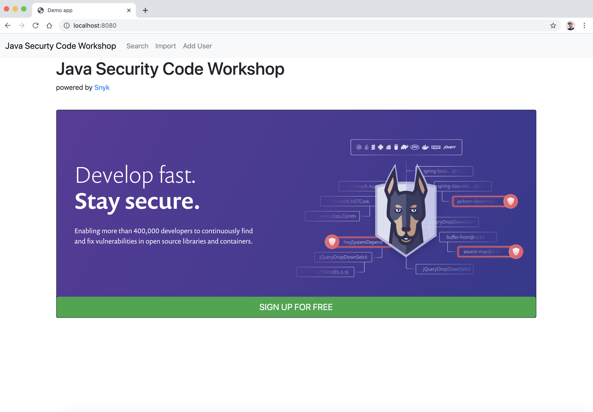
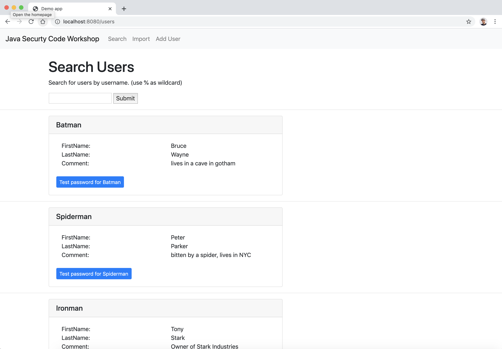
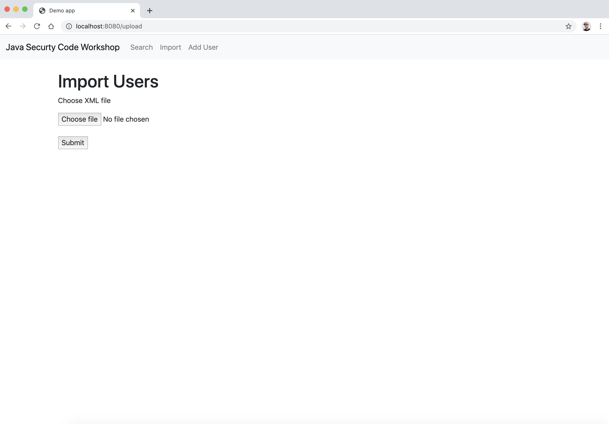

# Java Security Code Workshop
In this step by step workshop you'll learn how to exploit this Java application and the code changes you need to make to fix it.

## Required software
- Java 8
- Maven
- Browser (prefable Chrome)
- IDE / Code editor

# Introduction

This workshop contains a demo Java application build on with Spring boot and Thymeleaf.
It contains a number of security issues in the source code.
During this workshop you will locate, exploit and fix the vulnerabilities in this application.

The vulnerablilities covered in this workshop:
- XML External entity injection (XXE)
- SQL injection
- Cross side scripting (XSS)
- Encryption
- 

## Installation

- Check out the repository
- go to the `java-code-workshop` folder
- Run `mvn clean package`
- Run `mvn spring-boot:run`

Alternatively you can run this Spring boot app from your IDE if you wish to do that.

## Application
When your application is running you can access it at [http://localhost:8080/](http://localhost:8080/)

This application allows you to search through a user database and allows you do some basic admin tasks on that.
Play around for a bit to see how it works.

# Assignments

## Assignment 1 Search

On the Search page you can search the users by **username**.
By using a `%` you can provide wildcards. For instance `Super%` will give you the result for **Superman**
Using the search term `%man`

### 1a Try to create as search phrase that searches for the **firstname** 'Bruce'

    
Click to see [Hint 1](hints/search/hint1.md)

Click to see [Hint 2](hints/search/hint2.md)

    
### 1b Try to override every **lastname** with 'EVIL'
    
Click to see [Hint 3](hints/search/hint3.md)

Click to see [Hint 4](hints/search/hint4.md)
    
### 1c Fix the vulnerability

Click to see [Hint 5](hints/search/hint5.md)

Click to see [Hint 6](hints/search/hint6.md)

Click to see [Hint 7](hints/search/hint7.md)

## Assignment 2 Import

On the import page you can import new users by using an XML.
We already created a sample XML file `users.xml` that you can use to import new users

### 2a import new users using the `user.xml` file.
### 2b edit the file so we can read the `etc/passwd` file on your machine (or any other file for that matter)

Click to see [Hint 1](hints/import/hint1.md)

Click to see [Hint 2](hints/import/hint2.md)

Click to see [Hint 3](hints/import/hint3.md)

Click to see [Hint 4](hints/import/hint4.md)

Click to see [Hint 5](hints/import/hint5.md)

Click to see [Hint 6](hints/import/hint6.md)

### 2c Fix the vulnerability

Click to see [Hint 7](hints/import/hint7.md)

Click to see [Hint 8](hints/import/hint8.md)

    

 
